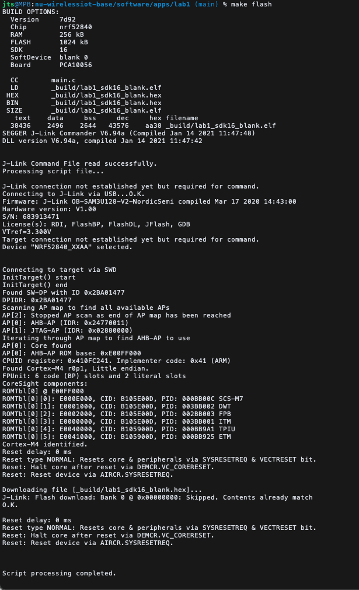

# Spinny LEDs App

Lights up the LEDs one at a time in a circle. Press Button 2 to make it faster, or Button 1 to make it slower.

## Demo

[Video Example](video.mov "video")

## make output

## Did/didn't work
I was able to load all the programs and the board was working as expected, but I wasn't able to see the printf text in my terminal.