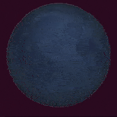

# Lab2: BLE advertisements
### Github Code:
https://github.com/jtschuster/nu-wirelessiot-base/tree/main/software/apps/lab2

## Scanning Application
In ble_scan, I implemented a few filters, one that searches for the name field, one that filters on the peer address, and one that filters on the EddyStone marker being present.

## Advanced advertising
In ble_adv_raw, I sent a URI in the BLE advertizement with the 'http:' abbreviated to 0x16. The Field data type value for URI's is 0x24. I used bing.com because it was a short enough URI to fit in the advertisement. To do this, I appended to the payload (1) the length of the URL + 1 for the field type byte, (2) the URI data type value (0x24), and (3), the URL with the shortening byte to not have to use "http:".

## EddyStone advertising
In the advertisement, there is flags (header 0x01), "Complete List of 16-bit Service Class UUIDs" (header 0x03), and Service Data (0x16), followed by the URL. The simple_ble implementation automatically appends the "https://" prefix by putting 0x03. In particular, the bytes were:

Flags:  
0x02 
0x01 
0x06 

Complete List of 16-bit Service Class UUIDs:  
0x03 
0x03 
0xaa 
0xfe 

Service Data:  
0x10 
0x16 
0xaa 
0xfe 
0x10 
0xba 
0x03 
0x67 (g)
0x6f (o)
0x6f (o)
0x67 (g)
0x6c (l)
0x65 (e)
0x2e (.)
0x63 (c)
0x6f (o)
0x6d (m)

## Secret message
The secret message is in a company specific data field. It is a University of Michigan company ID. The data after is UTF-8 encoding for moon phase emojis.

Hidden Message:

### Issues:
I ran into a number of off by one errors with the size of the field not including the size byte, and with the first byte being the data type number of the field.