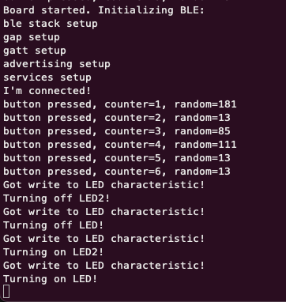
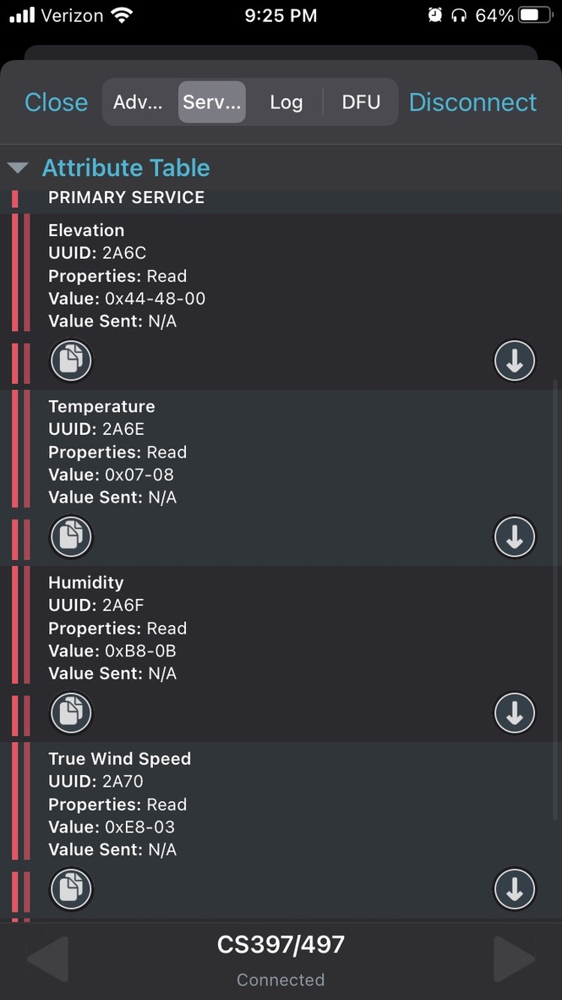
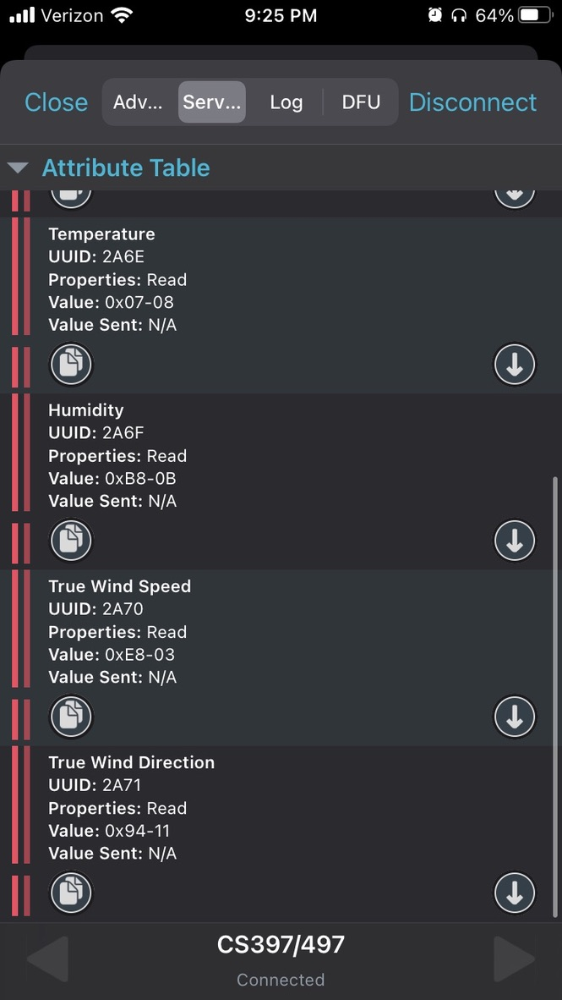

# Lab 3 - Connections

### Code at 

`github.com/jtschuster/nu-wirelessiot-base/tree/main/software/apps/lab3_connections`

`github.com/jtschuster/nu-wirelessiot-base/tree/main/software/apps/lab3_ble_ess_example`

1. Wireshark. 
I was unable to get wireshark working. The scripts ran without an issue, but I was unable to the external capture option to appear on the wireshark app on MacOS. 

2. My advanced service controls the state of LED1 and LED2, provides a "random" number, and notifies every time Button 1 is pressed with the count of presses. This code is in the `lab3_connections` folder.

3. I was able to transmit temperature, pressure, wind speed, wind direction, and elevation. The iOS version of NRF Connect app knew what the fields were for, but it didn't show the values with the correct units. The code is in the `lab3_ble_ess_example` folder.

4. I ran into some issues with the desktop NRF App not being able to connect to an nrf52 board. I got it to work once, but it would time out when trying to connect when I tried it later.